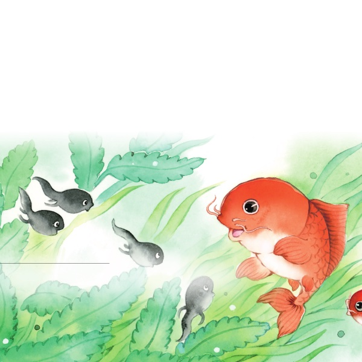
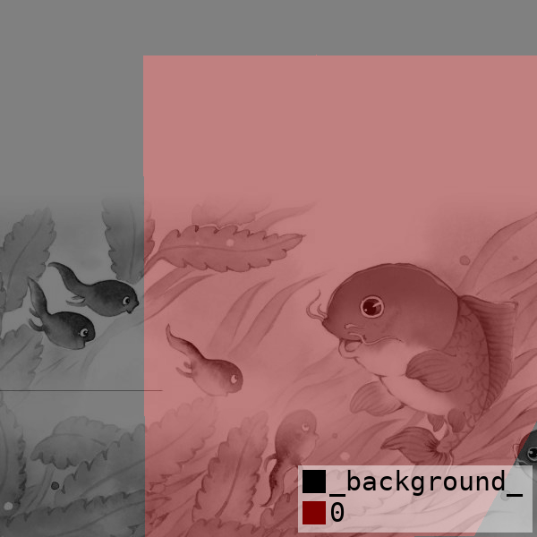

# AnimateAnyghing: Fine Grained Open Domain Image Animation with Motion Guidance
Project page: https://animationai.github.io/AnimateAnything/

Arxiv Link: https://arxiv.org/abs/2311.12886

<video src="docs/4_sr.mp4" controls title="Barbie"></video>
A girl is talking.

| Reference Image  | Motion Mask | GIF |
| ------------- | ------------- | -------- |
|   |  |  The fish and tadpoles are playing.|


## Getting Started
This repository is based on [Text-To-Video-Finetuning](https://github.com/ExponentialML/Text-To-Video-Finetuning.git).

### Create Conda Environment (Optional)
It is recommended to install Anaconda.

**Windows Installation:** https://docs.anaconda.com/anaconda/install/windows/

**Linux Installation:** https://docs.anaconda.com/anaconda/install/linux/

```bash
conda create -n animation python=3.10
conda activate animation
```

### Python Requirements
```bash
pip install -r requirements.txt
```

### Pretrained models
Download pretrained [motion mask and motion strength model](https://cloudbook-public-production.oss-cn-shanghai.aliyuncs.com/animation/mask_motion_v1.tar) and unzip it in the directory output/latent/mask_moition_v1


## Running inference
Please download the checkpoints to output/latent, then run the following command:
```bash
python train.py --config output/latent/mask_motion_v1/config.yaml --eval validation_data.prompt_image=example/barbie2.jpg validation_data.prompt='A cartoon girl is talking.'
```

To control the motion area, we can use the labelme to generate a binary mask. First, we use labelme to drag the polygon the reference image.


Then we run the following command to transform the labelme json file to a mask.

```bash
labelme_json_to_dataset qingming2.json
```


Then run the following command for inference:
```bash
python train.py --config output/latent/mask_motion_v1/config.yaml --eval validation_data.prompt_image=example/qingming2.jpg validation_data.prompt='Peoples are walking on the street.' validation_data.mask=example/qingming2_label.jpg 
```


User can ajust the motion strength by using the mask motion model:
```bash
python train.py --config output/latent/mask_motion_v1/
config.yaml --eval validation_data.prompt_image=example/qingming2.jpg validation_data.prompt='Peoples are walking on the street.' validation_data.mask=example/qingming2_label.jpg validation_data.strength=5
```
## Video super resolution
The model output low res videos, you can use video super resolution model to output high res videos.  For example, we can use [Real-CUGAN](https://github.com/bilibili/ailab/tree/main/Real-CUGANfor) cartoon style video super resolution:

```bash
git clone https://github.com/bilibili/ailab.git
cd alilab
python inference_video.py
```

## Shoutouts

- [Text-To-Video-Finetuning](https://github.com/ExponentialML/Text-To-Video-Finetuning.git)
- [Showlab](https://github.com/showlab/Tune-A-Video) and bryandlee[https://github.com/bryandlee/Tune-A-Video] for their Tune-A-Video contribution that made this much easier.
- [lucidrains](https://github.com/lucidrains) for their implementations around video diffusion.
- [cloneofsimo](https://github.com/cloneofsimo) for their diffusers implementation of LoRA.
- [kabachuha](https://github.com/kabachuha) for their conversion scripts, training ideas, and webui works.
- [JCBrouwer](https://github.com/JCBrouwer) Inference implementations.
- [sergiobr](https://github.com/sergiobr) Helpful ideas and bug fixes.
